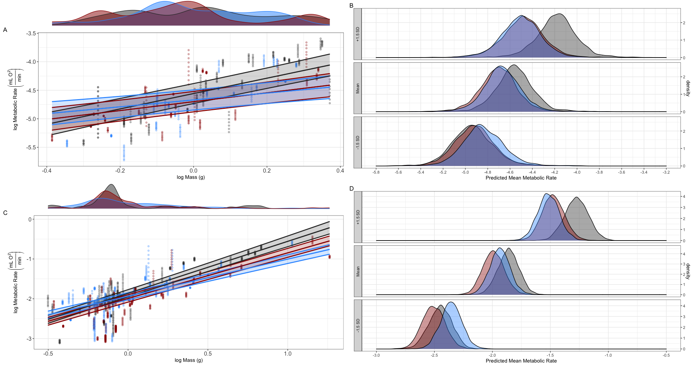

```{r setup, include=FALSE}
knitr::opts_chunk$set(echo = FALSE, cache = TRUE)
```
```{r, package, results = 'hide'}
# Packages
pacman::p_load("lme4", "tidyverse", "MASS", "brms", "MCMCglmm", "quantreg","lmerTest", "emmeans", "latex2exp", "DHARMa", "tidybayes", "bayesplot", "rstanarm", "plotrix", "emmeans", "patchwork", "ggExtra", "sjPlot", "lazerhawk", "kableExtra")
```
# Materials and methods
*Lizard collection and husbandry* 
<p>*Bassiana duperreyi –* The eastern three-lined skink, is an oviparous lizard that is a communal nester at cool high elevational populations (Shine et al. 2002). On 21 November 2020, a total of 25 nests and 100 eggs were opportunistically located by flipping rocks, logs, and other cover objects at two field locations within the Brindabella Range (Mount Ginini - 1640 m a.s.l., 35°31'29.6"S 148°46'58.7"E; Piccadilly Circus - 1240 m a.s.l., 35°21'42.0"S 148°48'12.5"E). These sites were selected because of prior work that documented high frequencies of sex reversal occurring within populations (Shine 2002; Dissanayake et al., 2021). At each nest, the number of eggs was documented and temperature dataloggers (iButton® model DS1921G, Maxim Integrated, San Jose, CA, USA; accuracy $\pm$ °C from -30°C to +70°C; diameter 17 mm, height 6.2 mm, mass 3.2 g) were placed at the core of each nest to monitor nest temperatures in order to determine developmental rates. Using mean nest temperatures at each location (Mount Ginini [20.42°C $\pm$  SD 0.84] & Piccadilly Circus [18.94°C $\pm$ SD 0.98]; Dissanayake et al., in review), we allowed each nest to be exposed in natural conditions for 9-10 weeks at which ensured approximately 90% of the development period (Shine et al. 2002). Eggs were then collected and placed in moist vermiculite (water potential – 200kPa). Eggs were transported back to University of Canberra where they were placed in incubators that maintained 23°C, which the null expectation is 50% males (Shine et al., 2002). While in incubators, eggs were gently rotated every couple of days, and hatchlings were removed as soon as they emerged from the egg. See Dissanayake et al., in review for detail on discerption of study sites and general egg collection. Once hatchlings emerged, phenotypic sex was determined by squeezing the tail base to manfully evert hemipenes (Harlow, 1996). Tail tips (4-5 mm) were removed with a sterile blade and tail tips were collected into labeled 1.5 ml tubes containing 90% ethanol and remaining blood from tail was collected on Whatman FTATM Elute Micro Card/CAT No. WB120410. Lizards were then housed individually in plastic containers (0.35x0.25x0.15m) for a minimum of 2 weeks until respirometry experiments.<p>
<p>*Pogona vitticeps –*  The University of Canberra (UC) maintains a breeding colony of adult *P. vitticeps* where breeding groups of adult lizards comprised of three sex reversed females (ZZf) to one male (ZZ), and three concordant females (ZWf) to one male. During the summer of 2020–2021, females were allowed to lay eggs naturally and then eggs were collected at lay or within two hours of lay. Eggs (n=102) were then placed in temperature-controlled incubators ($\pm$ 1°C) on moist vermiculite (water potential – 150kPa). Eggs were randomly allocated from each clutch (n = 20) and incubated at either 28°C (n= 43) or 34°C (n = 58) to ensure a balance across of phenotypic-genotypic combination of offspring when hatched. Once hatchlings emerged, phenotypic sex and tissue samples were following the same protocols for *B. duperreyi*. Hatchlings were then housed, 5 individuals per cage, in plastic containers (0.8x0.5x0.35m) for a minimum of 2 weeks until they were used for respirometry experiments.<p>
*Genotyping*
<p>Genotypic sex for both *B. duperreyi* and *P. vitticeps*, was determined using a polymerase chain reaction (PCR)-based molecular sex test from extracted DNA collected from tail tips or Whatman FTATM Elute Micro Card. DNA was extracted from tissue samples following the manufacturer protocols. DNA purity was determined using a NanoDrop 1000 spectrophotometer (NanoDrop Technologies Inc., Wilmington, DE, USA) and quantified using the Qubit 2.0 Fluorometric Quantitation (Invitrogen, Life technologies, Sydney, N.S.W., Australia). For *B. duperreyi* we tested for sex reversal using PCR as described by Quinn et al. (2009), where the genotypic sex was identified based off Y-specific markers allowing identification of XX and XY samples.  No XY females were observed, another indication that recombination and/or mutation involving these loci is negligible and has not affected the accuracy of genotypic sex assignment. Genotypic sex (ZZ/ZW) for *P. vitticeps*, was determined using a PCR based molecular sex test that amplifies a W-chromosome-specific size polymorphism (Holleley et al., 2015) using sex linked markers identified by Quinn et al. (2007). Two bands amplify in ZW individuals (identifying the presence of the W chromosome), whereas a single control band amplifies in ZZ individuals. All PCR products were visualized on a 1.5% agarose gel using SYBR Safe (Life Technologies, Carlsbad, USA), and all molecular sex tests were conducted blind to the phenotypic sex of the individuals. For both *B. duperreyi* and *P. vitticeps*, animals showing genotype–phenotype discordance were classified as sex-reversed (Shine et al., 2002; Holleley et al., 2015).<p>
*Respirometry*
<p>Standard metabolic rate (SMR) was defined as the average O$_{2}$ produced by an individual produced during the duration of each sampling period. A flow-through respirometry system was used to measure SMR of O$_{2}$ production (V̇O$_{2}$, mL min−1) with a stable systems FMS (Sables System FMS (Las Vegas NV, USA). A gas analyser sub-sampler pump was used to pump outside air scrubbed of CO$_{2}$ (using soda lime, Chem-Supply, **LOCATION**) and water vapour (using Drierite, W. A. Hammond Drierite Co. Ltd, **LOCATION**) to a mass flow controller that regulated flow rate to a nominal value of 130 ml min−1 (*B. duperreyi*) or 250 ml min$^{-1}$ (*P. vitticeps*). After passing through the mass flow controller, air was pushed through an airtight cylindrical respirometry chamber, which dimensions were designed specifically for each species (*B. duperreyi*: 75x20mm; *P. vitticeps*:200x40mm). Once air was pushed through chambers, it was then pushed to a flow meter which insured flow rates were constant. Air was then rescrubbed of water vapor (using Drierite) before being passed through a H2O analyser, CO$_{2}$, and O$_{2}$ gas analysers. The fractional concentration of O$_{2}$ in the ex-current air (FEO$_{2}$) was recorded at a frequency of 1 Hz. Following the manufacture protocols, both CO$_{2}$ and O$_{2}$ analysers were calibrated prior to experiments. <p>
<p>To ensure lizards are at a postabsorptive state, lizards were fasted for a minimum 24 hours prior to respirometry measurements. Body mass of each lizard was measured to 0.01g using a digital sale (Ohaus SP-202) before and after being placed in respirometry chambers. Two incubators (LabWit, ZXSDR1090) were used to precisely control outside air being pulled into the respirometry system and another to control the temperature where chambers were placed for measurements taken for experiments ($\pm$ 0.01°C). Once lizards were placed in chambers, they were then placed inside incubators in the dark for approximately 12-14h beginning around dusk. Incubator temperatures held a constant temperature which was within the mean field body temperatures for each species, 34°C for *B. duperreyi* (Du et al., 2010) and 33°C *P. vitticeps* (Wild et al., *in prep*). Over a 65 min period each individual was measured at least once continuously for 5 min, with a control/baseline air sample immediately taken. To ensure animals were acclimated within chambers, the first 2 h of data was discarded from analysis. Output peaks of O$_{2}$ were identified using the R package “metabR” (github.com/daniel1noble/metabR) to calculate percentage of O$_{2}$ above baseline sample. The rate of O$_{2}$ produced by an individual was calculated following (Lighton 2008): 
$$
V_{02}\ mL\ min^{-1}= \frac{\%O_{2} (V_{Chamber}- V_{lizard})}{\ t} 
$$
Where the rate of O$_{2}$ is the maximum percentage of O$_{2}$ in a sample above that baseline; V$_{Chamber}$ is the volume of the chamber (B. duperreyi: 23.56 mL; P. vitticeps:251.33 mL); V$_{lizard}$ was calculated as an average between the prior and post chamber mass of each individual, and t is the duration of time in minutes between samples. The mass of each lizard was used as a proxy for its volume (1g = 1 ml) because of their high correlation and increased accuracy and precision in mismeasurements (Friesen et al., 2017). <p>
*Statistical analysis*
<p>All statistical analysis were conducted using the R environment, ver. 4.1.0 (www.r.-project.org). Bayesian linear mixed effect models from the package “brms” (Burkner, 2017) were used to analyze O2 data for each species. With our “brms” models, we used default priors and ran 4 MCMC chains of 5000 with a burn in of 1000 and a thinning interval of 5. All models were checked for proper mixing and convergence by visually inspecting trace plots. For each species we fit two models, the first that assumed homoscedasticity within the data and the second that accounted for heteroscedasticity within the data. The first model was fit using the following structure: 
$$
MR_{ijk} = \left ( \beta_{0} + id_{j} + d_{k}\right) + \left( \beta_{6} +  \beta_{id_{j}} \cdot time_{z} \right) + \beta_{1} \cdot Sex_{XXf} + \beta_{2} \cdot Sex_{XYm} + \beta_{3} \cdot log \ Mass_{sc} + \beta_{4} \cdot log \ Mass_{sc} \cdot Sex_{XXf} + \beta_{5} \cdot log \ Mass_{sc} \cdot Sex_{XYm} + e_{ijk}
$$
Where $MR_{ijk}$ is the metabolic rate ($log\ VO_2 \cdot mL^{-1} \cdot min^{-1}$) for measurement *i* (i = 1 to $N_{m}$, number of measurements) on individual *j* (j = 1 to $N_{id}$, number of individuals) and day *k* (k = 1 to $N_{d}$, number of days).  We estimated a linear slope ($\beta_{6}$) for measurement time ($time_{z}$, z-transformed); a linear slope for log transformed mass ($log \ Mass_{sc}$, centered on mean, sc) and contrasts for the difference sex classes ($\beta_{1}-\beta_{2}$), where $Sex_{XXf}$ and $Sex_{XYm}$ are for true sex and sex reversed animals, respectively. We also estimated different mass scaling relationships for the different sex classes (i.e., $\beta_{4} \cdot log \ Mass_{sc} \cdot Sex_{XXf}$ and  $\beta_{5} \cdot log \ Mass_{sc} \cdot Sex_{XXm}$, respectively). We included a random intercept ($id_{j}$) and slope for $time_{z}$ ($\beta_{id_{ij}}$) for individual *j* across measurement occations. Deviations were sampled from a multivariate normal distribution (~$MVN \left( [0,0], ID \right)$, where **ID** is a (co)variance matrix with a random intercept and slope variance and their covariance). We also included a random day effect ($d_{k}$) (~ $N\left( 0, \sigma^2_{k}\right)$).<p>
<p>To understand if the distribution of mass specific metabolic was influenced differently across sex, we predicted metabolic rate at three distributions of zlogBodyMass ($\mu$, +1SD, and -1SD). Distributions of metabolic rate were derived from predictions of Brms models using the predict function. We compared how these mass distributions ($\mu$, +1SD, and -1SD) influenced predicted metabolic rate values and how they varied across sex following this model structure: 
$$
MR_{predict}\ = \ O2_{estimate} \cdot sex\ class+ mass_{t} +sex\ class\cdot mass_{t} 
$$
Where $MR_{predict}$ is the predicted  metabolic rate measurement for each mass distribution, $O_{2\ estimate}$ is the predicted $O_{2}$ from our Brms model, sex class is the chromosome and phenotypic complement for each species, $mass_{t}$ is the category of mass distribution ($\mu$, +1SD, and -1SD) and their interaction. When results were significant, we followed with pairwise comparisons from emmeans package in R (Lenth et al., 2018). <p>
# Results
```{Bassiana results, loo comparison, echo=FALSE, message=FALSE, warning=FALSE}
# raw data
bassiana.data <- read.csv("~/Dropbox/energy_sex_reversal/final.analysis.data/Bassiana.finalO2.sexreversal.analysis.data.clean.csv") %>% 
  rename(day =date.dd.mm.yy.,
         time = marker_sample,
         id = bd_liz_id, 
         O2_min = Final_MR_O2_min,
         sex = Geno.pheno,
         mass_g = mass) %>% 
  mutate(ztime = scale(time),
         zlogMass = scale(log(mass_g), scale = FALSE),
         zstartmass = scale(log(start_mass_g), scale = FALSE),
         zendmass = scale(log(end_mass_g), scale = FALSE))%>% 
  dplyr::select(-X, -Date.Hatched, -MR_O2_min)

# sample size 
bassiana.sample.size <- bassiana.data %>%
  group_by(id, sex) %>% 
  summarise(n = n()) %>% 
  ungroup() %>% 
  group_by(sex) %>% 
  summarise(n = n()) %>% 
  mutate(total.sample.size = sum(n),
         total.n.samples = 760)
    
######  Metabolic rate Bassiana ######  
# loo comparison
Bas_m1_brms <- readRDS(file = "~/Dropbox/energy_sex_reversal/models/Bas_m1_brms")
Bas_m2_brms <- readRDS(file = "~/Dropbox/energy_sex_reversal/models/Bas_m2_brms")
loo_compare(Bas_m1_brms, Bas_m2_brms)
bayes_R2(Bas_m1_brms)

# Model output table
Bas_m1_table <- lazerhawk::brms_SummaryTable(Bas_m1_brms)

# Posteriors 1)figure & 2) table
# extracting posteriors 
post_Bas_m1 <- posterior_samples(Bas_m1_brms, pars = "^b")
dimnames(post_Bas_m1)
XXf <- as.array(post_Bas_m1[,"b_zlogMass"])
XXm <- as.array(post_Bas_m1[,"b_zlogMass"] + 
                post_Bas_m1[,"b_sexXX_Male:zlogMass"])
XYm <- as.array(post_Bas_m1[,"b_zlogMass"] + 
                post_Bas_m1[,"b_sexXY_Male:zlogMass"])
bass.dat <- cbind(XXf, XXm, XYm)

#1) plotting posteriors 
mcmc_areas(bass.dat, 
           pars = c("XXf", "XXm", "XYm"),
           prob = 0.95, 
           prob_outer = 0.99, 
           point_est = "mean")+
  theme_bw() +
  theme(axis.text = element_text(size=12)) +
  theme(legend.title = element_text(colour="white", size = 16, face='bold')) +
  labs(y = TeX("Sex class"), x = "Slope")

# 2) posterior table
Bas.postior.table <- Bas_m1_brms %>%
  emmeans( ~sex  ) %>%
  gather_emmeans_draws() %>%
  median_qi() %>% 
  rename(Estimate = .value,
         Upper = .upper,
         Lower = .lower) %>% 
  dplyr::select(-c(.width, .interval, .point))

# contrast phenotype slopes
bass.phenotype <- as.mcmc(XXm - XYm)
mean(bass.phenotype)
HPDinterval(bass.phenotype)

# contrast genotype slopes 
bass.genotype <- as.mcmc(XXf - XXm)
mean(bass.genotype)
HPDinterval(bass.genotype)

##### SD prediction data and ANOVA comparison and posthoc test with emmeans
Bass_SD_dat <- readRDS(file = "~/Dropbox/energy_sex_reversal/final.analysis.data/Bassiana.SD.mod.dat.RDS")
BassSD_mod <- lm(Estimate ~sex +test+ sex*test, data = Bass_SD_dat)
summary(BassSD_mod) 
Bass.pairwise.comparision <- emmeans(BassSD_mod, pairwise ~ sex | test)
Bass.pairwise.comparision
plot(Bass.pairwise.comparision)

###### Body size comparison with BRMS model
bass.bodymass <- readRDS("~/Dropbox/energy_sex_reversal/models/Bas_bodymass")
summary(bass.bodymass)
bm_diff <- hypothesis(bass.bodymass, 'sexXX_Male + sexXY_Male = 0')
mean(bm_diff$samples$H1)
HPDinterval(mcmc(bm_diff$samples$H1))
# p-value equivalent for the full hypothesis test. 
bassiana.bodysize <- 1 - (table(bm_diff$samples$H1 > 0)[1] / (length(bm_diff$samples$H1) - 1))   
```
<p>*Bassiana duperreyi –* We recorded a total of 760 observations for 40 individuals (XXf:n = 15, XYm:n = 12, XXm:n = 13). According to loo values there was equal support for both models, but preference for the second model that accounted for heteroscedasticity ([heteroscedastic model  – homoscedastic model] loo: ELPD = -5.6, SE = 6.8), with 77% of the variation being explained by this model. Overall, we found little evidence for 
<p>
```{Pogona results, echo=FALSE, message=FALSE, warning=FALSE}
# raw data
pogona.data <- read.csv("~/Dropbox/energy_sex_reversal/final.analysis.data/Pogona.finalO2.sexreversal.analysis.data.clean.csv") %>% 
  rename(day =date.dd.mm.yy.,
         time = marker_sample,
         id = bd_liz_id, 
         O2_min = Final_MR_O2_min,
         sex = Geno.pheno,
         mass_g = mass) %>% 
  group_by(sex) %>% 
  mutate(ztime = scale(time),
         logmass = log(mass_g), 
         zlogMass = scale(log(mass_g), scale = FALSE),
         zstartmass = scale(log(start_mass_g), scale = FALSE),
         zendmass = scale(log(end_mass_g), scale = FALSE)) %>% 
  dplyr::select(-X, -Date.Hatched, -MR_O2_min)

# sample size 
pogona.sample.size <- pogona.data %>%
  group_by(id, sex) %>% 
  summarise(n = n()) %>% 
  ungroup() %>% 
  group_by(sex) %>% 
  summarise(n = n()) %>% 
  mutate(total.n.individuals = sum(n),
         total.n.samples = 1365)

######  Metabolic rate Pogona ######  
# loo comparison
Pog_m1_brms <- readRDS(file = "~/Dropbox/energy_sex_reversal/models/Pog_m1_brms")
Pog_m2_brms <- readRDS(file = "~/Dropbox/energy_sex_reversal/models/Pog_m2_brms")
loo_compare(Pog_m1_brms, Pog_m2_brms)
bayes_R2(Pog_m2_brms)

# Model output table
tab_model(Pog_m2_brms)
Pog_m2_table <- lazerhawk::brms_SummaryTable(Pog_m2_brms)

# Posteriors 1)figure & 2) table
post_pog_m2 <- posterior_samples(Pog_m2_brms, pars = "^b")
# extracting posteriors 
ZWf <- as.array(post_pog_m2[,"b_zlogMass"])
ZZf <- as.array(post_pog_m2[,"b_zlogMass"] + 
                  post_pog_m2[,"b_sexZZf:zlogMass"])
ZZm <- as.array(post_pog_m2[,"b_zlogMass"] + 
                  post_pog_m2[,"b_sexZZm:zlogMass"])
# combining to one df
pog.dat <- cbind(ZWf, ZZf, ZZm)

# 1)plotting posteriors 
mcmc_areas(pog.dat, 
           pars = c("ZWf", "ZZf", "ZZm"),
           prob = 0.95, 
           prob_outer = 0.99, 
           point_est = "mean")+
  theme(legend.title = element_text(colour="white", size = 16, face='bold')) +
  labs(y = TeX("Sex class"), x = "Slope")

# 2) posterior table
Pogona.postior.table <- Pog_m2_brms %>%
  emmeans( ~ sex ) %>%
  gather_emmeans_draws() %>%
  median_qi() %>% 
  rename(Estimate = .value,
         Upper = .upper,
         Lower = .lower) %>% 
  dplyr::select(-c(.width, .interval, .point))

# contrast phenotype slopes
pog.phenotype <- as.mcmc(ZWf - ZZf)
mean(pog.phenotype)
HPDinterval(pog.phenotype)
hypothesis(Pog_m2_brms, "zlogMass + sexZZf:zlogMass = 0")

# contrast genotype slopes 
pog.genotype <- as.mcmc(ZZf - ZZm)
mean(pog.genotype)
HPDinterval(pog.genotype
hypothesis(Pog_m2_brms, "sexZZf:zlogMass + sexZZm:zlogMass = 0")

##### SD prediction data and ANOVA comparison and posthoc test with emmeans
Pogona_SD_dat <- readRDS(file = "~/Dropbox/energy_sex_reversal/final.analysis.data/PogonaSD.mod.dat.RDS")
Pogona_SD_dat <- lm(Estimate ~sex +test+ sex*test, data = Pogona_SD_dat)
summary(Pogona_SD_dat) 
anova(Pogona_SD_dat)
Pogona.pairwise.comparision <- emmeans(Pogona_SD_dat, pairwise ~ sex | test)
Pogona.pairwise.comparision
plot(Pogona.pairwise.comparision)

###### Body size comparison with BRMS model  ######  
pog.bodymass <- read_rds("~/Dropbox/energy_sex_reversal/models/Pog_bodymass")
summary(pog.bodymass)
bm_diff <- hypothesis(pog.bodymass, 'sexZZf + sexZZm = 0')
mean(bm_diff$samples$H1)
HPDinterval(mcmc(bm_diff$samples$H1))
# p-value equivalent for the full hypothesis test. 
pogona.bodysize <- 1 - (table(bm_diff$samples$H1 > 0)[1] / (length(bm_diff$samples$H1) - 1))      
```
<p>*Pogona vitticeps -* We recorded a total of 1365 observations for 96 individuals (ZWf:n = 30, ZZm:n = 38, ZZf:n = 38). According to loo values there was preference for the second model that accounted for heteroscedasticity ([heteroscedastic model  – homoscedastic model] loo: ELPD = -189.0, 34.3), with 84% of the variation being explained by this model. 

<p>
# Figures & Tables
```{r, fig.align = 'center', fig.cap = "Theoretical framework to test the metabolic consequences of sex-reversal using two model systems with different patterns of genetic sex determination Bassiana duperryii [XYm (concordant male): XXf (concordant female): XXm (sex-reversed male)] and Pogona vitticeps [ZW (concordant female): ZZ (concordant male): ZZf (sex-reversed female)]. Where these hypotheses are tested by comparing how the energetic requirements vary across body mass and sex for each system. In each graph the y axis is log-transformed metabolic rate and the x-axis is log-transformed body mass. The like phenotype hypothesis suggests that sex-reversed individuals will resemble their phenotypic counterparts rather than their genotypic counterparts. The like phenotype hypothesis proposes that sex-reversed individuals will have similar energy requirements to their phenotypic counterparts regardless of their genotype. The like genotype hypothesis proposes that sex-reversed individuals will have similar energy requirements their genotypic counterparts regardless of their phenotype."}
knitr::include_graphics("./Figs/Theoretical framework.pdf")
```

```{r, fig.align = 'center', fig.cap = "Comparison of log metabolic rate (V_{02}\ mL\ min^{-1}) across log body mass (g) by sex class for *Bassiana duperryii* (A) and *Pogona vitticeps* (B). Points represent  metabolic measurements for each individual in relation to mass of each individual. Fitted lines were obtained from predicted values from the brms model for each species and confidence bands were constructed from the SE of prediction values for each sex. Density plots above each regression plot denote the distribution in body mass (log mass) by sex for each species. To visualize how log metabolic rate changes across log body mass, panels on the right show the distribution of predicted metabolic at three areas of log body mass (mean, +1SD, and -1SD) for each sex and species."}

```


